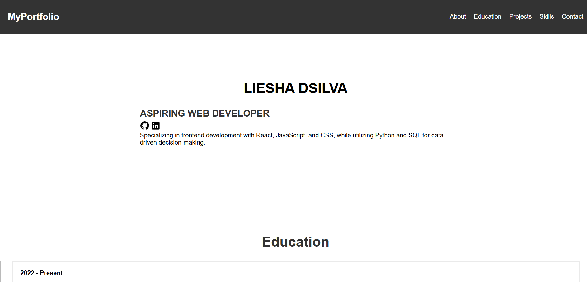
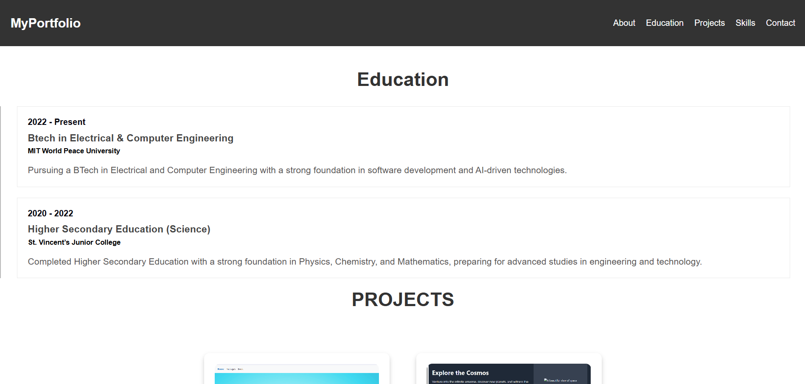
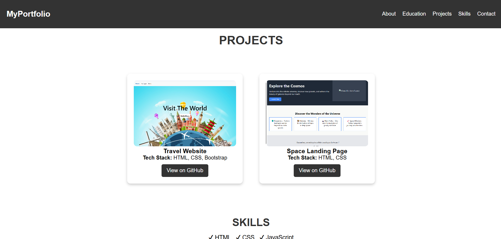
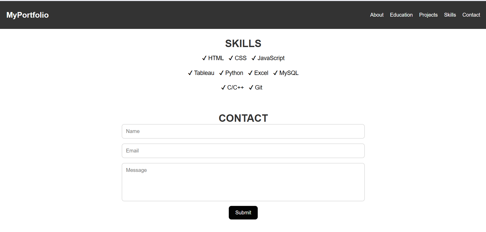

# 🚀 Liesha's Portfolio Website  

A personal portfolio website showcasing projects, skills, and education, with JavaScript-powered form validation.  

## 🌟 Features  
- 🎨 **Responsive Design** – Optimized for all devices.  
- 💡 **Projects Section** – Displays completed projects with GitHub links.  
- 📚 **Education & Skills** – Highlights qualifications and technical skills.  

## 📷 Preview  

### **Homepage**  
  

### **Education Section**  
  

### **Projects Section**  
  

### **Skills & Contact Form**  
  

## 🔧 Tech Stack  
- ✅ **HTML**  
- ✅ **CSS**  
- ✅ **JavaScript**  
